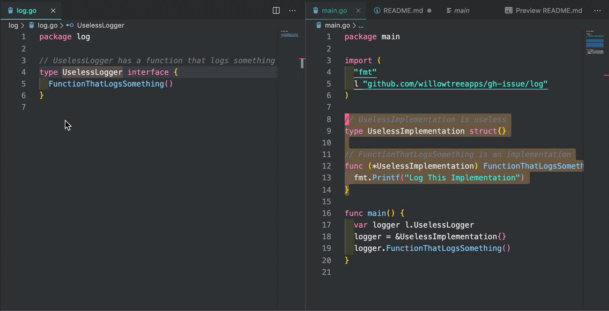

# Issue Repo

Provide example for this [issue](https://github.com/microsoft/vscode-go/issues/2957)

# Description

This happened after updating from the vscode go extension 0.11.7 to 0.11.8. Still persists on 0.11.9

**Note** This behaves as expected when interface is in same file.

# Steps to reproduce

1. Open `log/log.go`
2. Right click `UselessLogger` and select `Peek Implementations`

**Expected** Implementation in main.go is shown.

**Actual** No implementations found.



# System Info

**Go Version**: 1.13.4
**VS Code Version**: 1.41.1
**Go Extension**: 0.11.9
**OS**: Mac OS 10.14.6
**OS and Arch details**: darwin amd64

Related settings:

```json
{
  "go.formatTool": "goimports",
  "go.useLanguageServer": true
}
```

`gopls version` output:

```
golang.org/x/tools/gopls 0.2.2
golang.org/x/tools/gopls@v0.2.2 h1:ujGisyytgY1VGcmd66wIJ9+wVAfmodXj6daHM43HRXk=
```

When running the `Peek Implementation` command, I see this error in the `gopls` logs:

```
[Error - 12:56:13 PM] Request textDocument/implementation failed.
  Message: no type info object for identifier
  Code: 0
```

Output of `gopls -rpc.trace -v check`:

```
2019/12/24 13:49:21 Info:2019/12/24 13:49:21 Build info
----------
golang.org/x/tools/gopls 0.2.2
    golang.org/x/tools/gopls@v0.2.2 h1:ujGisyytgY1VGcmd66wIJ9+wVAfmodXj6daHM43HRXk=
    github.com/BurntSushi/toml@v0.3.1 h1:WXkYYl6Yr3qBf1K79EBnL4mak0OimBfB0XUf9Vl28OQ=
    github.com/sergi/go-diff@v1.0.0 h1:Kpca3qRNrduNnOQeazBd0ysaKrUJiIuISHxogkT9RPQ=
    golang.org/x/sync@v0.0.0-20190423024810-112230192c58 h1:8gQV6CLnAEikrhgkHFbMAEhagSSnXWGV915qUMm9mrU=
    golang.org/x/tools@v0.0.0-20191206201009-952e2c076240 h1:metzFnqcC0vUPmZX4El8bICiQU9hieZ3L9dXAitxVXQ=
    golang.org/x/xerrors@v0.0.0-20190717185122-a985d3407aa7 h1:9zdDQZ7Thm29KFXgAX/+yaf3eVbP7djjWp/dXAppNCc=
    honnef.co/go/tools@v0.0.1-2019.2.3 h1:3JgtbtFHMiCmsznwGVTUWbgGov+pVqnlf1dEJTNAXeM=

Go info
-------
go version go1.13.4 darwin/amd64

GO111MODULE=""
GOARCH="amd64"
GOBIN=""
GOCACHE="/Users/tylerfreeman/Library/Caches/go-build"
GOENV="/Users/tylerfreeman/Library/Application Support/go/env"
GOEXE=""
GOFLAGS=""
GOHOSTARCH="amd64"
GOHOSTOS="darwin"
GONOPROXY=""
GONOSUMDB=""
GOOS="darwin"
GOPATH="/Users/tylerfreeman/go"
GOPRIVATE=""
GOPROXY="https://proxy.golang.org,direct"
GOROOT="/usr/local/Cellar/go/1.13.4/libexec"
GOSUMDB="sum.golang.org"
GOTMPDIR=""
GOTOOLDIR="/usr/local/Cellar/go/1.13.4/libexec/pkg/tool/darwin_amd64"
GCCGO="gccgo"
AR="ar"
CC="clang"
CXX="clang++"
CGO_ENABLED="1"
GOMOD=""
CGO_CFLAGS="-g -O2"
CGO_CPPFLAGS=""
CGO_CXXFLAGS="-g -O2"
CGO_FFLAGS="-g -O2"
CGO_LDFLAGS="-g -O2"
PKG_CONFIG="pkg-config"
GOGCCFLAGS="-fPIC -m64 -pthread -fno-caret-diagnostics -Qunused-arguments -fmessage-length=0 -fdebug-prefix-map=/var/folders/98/53r1jt610435s1k9gttrd95h0000gp/T/go-build662881197=/tmp/go-build -gno-record-gcc-switches -fno-common"
2019/12/24 13:49:21 Info:2019/12/24 13:49:21 17.872129ms for GOROOT= GOPATH= GO111MODULE= PWD=/Users/tylerfreeman/go/src/github.com/willowtreeapps/gh-issue go "env" "GOMOD", stderr: <<>> stdout: <<
>>
2019/12/24 13:49:21 Info:2019/12/24 13:49:21 18.199535ms for GOROOT= GOPATH= GO111MODULE= PWD=/Users/tylerfreeman/go/src/github.com/willowtreeapps/gh-issue go "list" "-m" "-json" "all", stderr: <<go list -m: not using modules
>> stdout: <<>>
2019/12/24 13:49:21 Info:2019/12/24 13:49:21 21.016615ms for GOROOT= GOPATH= GO111MODULE= PWD=/Users/tylerfreeman/go/src/github.com/willowtreeapps/gh-issue go "list" "-e" "-json" "-compiled=true" "-test=true" "-export=false" "-deps=true" "-find=false" "--" "builtin", stderr: <<>> stdout: <<{
	"Dir": "/usr/local/Cellar/go/1.13.4/libexec/src/builtin",
	"ImportPath": "builtin",
	"Name": "builtin",
	"Doc": "Package builtin provides documentation for Go's predeclared identifiers.",
	"Target": "/usr/local/Cellar/go/1.13.4/libexec/pkg/darwin_amd64/builtin.a",
	"Root": "/usr/local/Cellar/go/1.13.4/libexec",
	"Match": [
		"builtin"
	],
	"Goroot": true,
	"Standard": true,
	"GoFiles": [
		"builtin.go"
	]
}
>>
2019/12/24 13:49:21 Info:2019/12/24 13:49:21 14.561624ms for GOROOT= GOPATH= GO111MODULE= PWD=/Users/tylerfreeman/go/src/github.com/willowtreeapps/gh-issue go "env" "GOPATH", stderr: <<>> stdout: <</Users/tylerfreeman/go
>>
2019/12/24 13:49:21 Info:2019/12/24 13:49:21 18.879817ms for GOROOT= GOPATH= GO111MODULE= PWD=/Users/tylerfreeman/go/src/github.com/willowtreeapps/gh-issue go "env" "GOMOD", stderr: <<>> stdout: <<
>>
2019/12/24 13:49:21 Info:2019/12/24 13:49:21 18.848884ms for GOROOT= GOPATH= GO111MODULE= PWD=/Users/tylerfreeman/go/src/github.com/willowtreeapps/gh-issue go "list" "-m" "-json" "all", stderr: <<go list -m: not using modules
>> stdout: <<>>
2019/12/24 13:49:21 Info:2019/12/24 13:49:21 16.795022ms for GOROOT= GOPATH= GO111MODULE= PWD=/Users/tylerfreeman/go/src/github.com/willowtreeapps/gh-issue go "env" "GOPATH", stderr: <<>> stdout: <</Users/tylerfreeman/go
>>
2019/12/24 13:49:21 Info:2019/12/24 13:49:21 26.446091ms for GOROOT= GOPATH= GO111MODULE= PWD=/Users/tylerfreeman/go/src/github.com/willowtreeapps/gh-issue go "list" "-e" "-json" "-compiled=true" "-test=true" "-export=false" "-deps=true" "-find=false" "--" "/Users/tylerfreeman/go/src/github.com/willowtreeapps/gh-issue/log", stderr: <<>> stdout: <<{
	"Dir": "/Users/tylerfreeman/go/src/github.com/willowtreeapps/gh-issue/log",
	"ImportPath": "github.com/willowtreeapps/gh-issue/log",
	"Name": "log",
	"Target": "/Users/tylerfreeman/go/pkg/darwin_amd64/github.com/willowtreeapps/gh-issue/log.a",
	"Root": "/Users/tylerfreeman/go",
	"Match": [
		"/Users/tylerfreeman/go/src/github.com/willowtreeapps/gh-issue/log"
	],
	"Stale": true,
	"StaleReason": "build ID mismatch",
	"GoFiles": [
		"log.go"
	],
	"CompiledGoFiles": [
		"log.go"
	]
}
>>
2019/12/24 13:49:21 Info:2019/12/24 13:49:21 go/packages.Load
	packages = 1
2019/12/24 13:49:21 Info:2019/12/24 13:49:21 go/packages.Load
	package = github.com/willowtreeapps/gh-issue/log
	files = [/Users/tylerfreeman/go/src/github.com/willowtreeapps/gh-issue/log/log.go]
```
